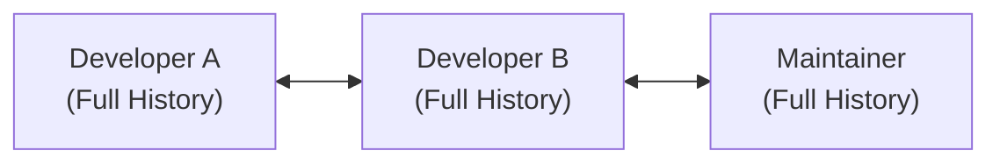
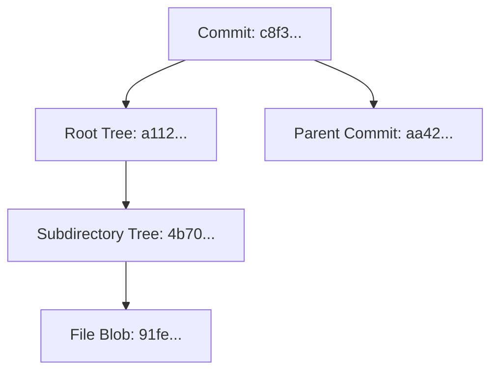
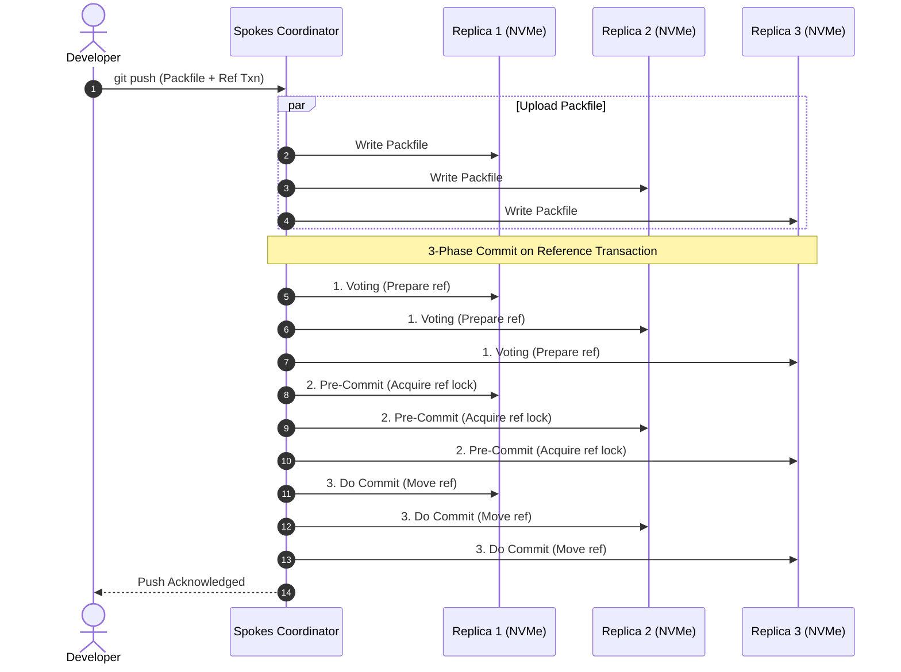
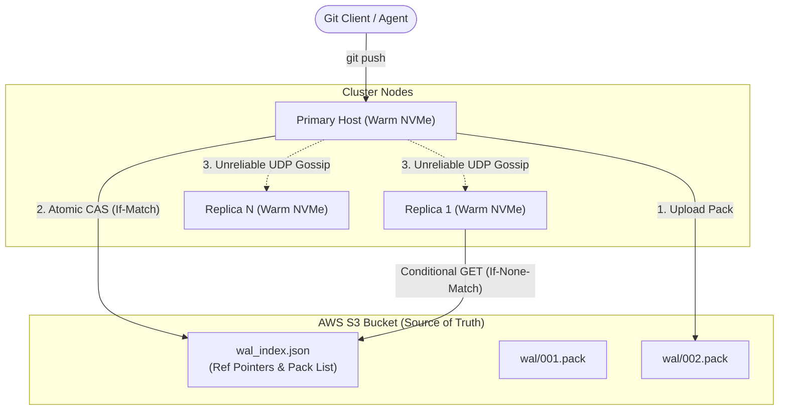
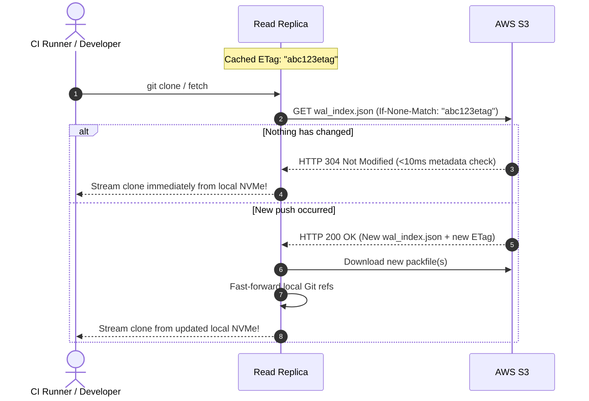

# Git at Any Scale: The Story & Architecture Behind Cursor's "Continuity" and "Origin"

> Based on Cursor's research blog post: [*Git at any scale*](https://cursor.com/blog/git-at-any-scale) by Vicent Martí.

---

## 📖 Table of Contents
1. [Prologue: The Linus Paradox & What's Hard About Git](#-prologue-the-linus-paradox--whats-hard-about-git)
2. [Act I: The Failed Experiments](#-act-i-the-failed-experiments)
   - [Attempt 1: Git Without Packfiles (Distributed Key-Value / DHT)](#attempt-1-git-without-packfiles-distributed-key-value--dht)
   - [Attempt 2: Shared Networked Filesystems (NFS & DRBD)](#attempt-2-shared-networked-filesystems-nfs--drbd)
3. [Act II: The 13-Year Veteran – GitHub's Spokes](#-act-ii-the-13-year-veteran--githubs-spokes)
   - [The Spokes Philosophy: 3PC & NVMe](#the-spokes-philosophy-3pc--nvme)
   - [Why Spokes Broke in the Modern Era](#why-spokes-broke-in-the-modern-era)
4. [Act III: Cursor's Breakthrough – Continuity](#-act-iii-cursors-breakthrough--continuity)
   - [Core Principle: S3 as the Single Source of Truth](#core-principle-s3-as-the-single-source-of-truth)
   - [Stateless Consensus & Rendezvous Hashing](#stateless-consensus--rendezvous-hashing)
   - [Optimistic Gossip + Conditional S3 GETs](#optimistic-gossip--conditional-s3-gets)
   - [Amortized Compaction](#amortized-compaction)
5. [Act IV: Origin – The Platform for the Agentic Era](#-act-iv-origin--the-platform-for-the-agentic-era)
6. [Act V: Our Working TypeScript + Bun Implementation](#️-act-v-our-working-typescript--bun-implementation)
7. [Phase Roadmap & Documentation](#-phase-roadmap--documentation)
8. [Running the System (CLI Demo & Tests)](#-running-the-system)
9. [Environment Configuration](#️-environment-configuration)

---

## 🎭 Prologue: The Linus Paradox & What's Hard About Git

In 2005, Linus Torvalds introduced Git as *"the information manager from hell"*. Git was crafted for a very specific environment: the Linux Kernel development process.
- **Extreme Decentralization:** Dozens of subsystem maintainers traded patches via email.
- **Offline First:** Developers could commit, branch, and inspect history without an active internet connection.
- **Every Clone is a Full Database:** There is nothing architecturally special about a remote repository versus a local folder on a developer's laptop.



Fast forward twenty years: **the software industry did the complete opposite**.

Instead of decentralized email patches, modern software development revolves around **centralized hubs** (GitHub, GitLab, and now automated AI agents running in the cloud). Yet, Git is notoriously hostile to centralized scale due to its core storage primitives:

### The Packfile Dilemma
Git organizes historical data (blobs, trees, commits, tags) into **packfiles** (`.pack`) and index files (`.idx`). 
1. **Network Obligation:** Git clients expect raw packfiles over HTTP/SSH. Linus isn't checking your backend, but the wire protocol strictly mandates packfiles.
2. **Local Disk Expectation:** Git was built to run against local filesystems using POSIX semantics (`mmap`, locks, atomic renames, zero-copy I/O).
3. **The Scaling Wall:** Storing repositories on a single disk limits you to single-machine capacity. If that disk dies, or if 5,000 CI jobs clone the repository at once, the system collapses.

To scale Git, companies historically faced three paths:
1. **Distribute the filesystem**
2. **Distribute the objects (Git without packfiles)**
3. **Distribute Git itself**

---

## 🧪 Act I: The Failed Experiments

Before arriving at modern designs, engineering teams spent over a decade proving what **cannot** work at scale.

### Attempt 1: Git Without Packfiles (Distributed Key-Value / DHT)

Because Git is content-addressable (every object is identified by the SHA hash of its contents), it seems tempting to store Git objects in a distributed key-value store (e.g., DynamoDB, Bigtable, or a Distributed Hash Table).



#### Why it fails: The DAG Walk
Git repositories are Directed Acyclic Graphs. Even the simplest operation (e.g., `git log -n 5` or `git checkout`) requires traversing the DAG step-by-step:
- You fetch the commit $\to$ discover the root tree pointer.
- You fetch the root tree $\to$ discover subtree and blob pointers.
- You fetch the commit $\to$ discover the parent commit pointer.

**At each hop, you do not know the next key until the previous key returns.** If every hop requires a network round-trip to a distributed KV store, latency compounds catastrophically. 

> [!WARNING]
> Shawn Pearce (creator of JGit) built a DHT-backed Git backend at Google. While everyday operations were tolerable, generating packfiles on-the-fly for `git clone` consumed immense CPU and caused massive network latency, leading Google to discard the design.

---

### Attempt 2: Shared Networked Filesystems (NFS & DRBD)

In 2008, GitHub started as a Rails monolith. The simplest idea to scale was: *"Leave Git and Rails unchanged; make the filesystem distributed so multiple Rails servers can access repositories over NFS or block-level replication (DRBD / GFS)."*

#### Why it fails: Random Physical Walks in Packfiles
Packfiles are compressed binary containers optimized for minimal storage:
- Objects are placed non-sequentially.
- Most objects are stored as **deltas** (differences applied to another base object elsewhere in the packfile).
- Following logical DAG links requires jumping to arbitrary byte offsets across multi-gigabyte packfiles on disk.

```
+------------------------------------------------------------------------+
|                          PACKFILE ON DISK                              |
|  [Delta Object A] --------> [Base Object B] --------> [Delta Object C] |
|   offset: 0x0400             offset: 0x8A20            offset: 0x11F0  |
+------------------------------------------------------------------------+
```

Over a local NVMe drive, random seeks are fast and absorbed by the OS page cache. Over NFS or DRBD block replication, random seeks over high-latency networks cause severe I/O stalls. With hundreds of thousands of repositories, caching entire filesystems in memory was impossible.

---

## 🛡️ Act II: The 13-Year Veteran – GitHub's Spokes

Around 2013, GitHub developed **Spokes**, an application-level replication engine that became the industry standard.

### The Spokes Philosophy: 3PC & NVMe

Spokes established three critical principles:
1. **Never distribute Git internals:** Keep plain, standard Git repositories on local, ultra-fast NVMe disks.
2. **Decouple Data from References:** A `git push` has two distinct layers:
   - **The Packfile:** Large binary payload containing raw objects (blobs, trees, commits).
   - **The Reference Transaction:** Updating a pointer (e.g., `refs/heads/main` moves from commit `c8f3` to `a996`).
3. **Consensus via Three-Phase Commit (3PC):**
   - The coordinator streams the incoming packfile to 3 replica nodes in parallel (no locks needed yet; data is unreachable until the ref points to it).
   - Once all nodes have the packfile, the coordinator executes a **3-Phase Commit** (`Voting` $\to$ `Pre-Commit / Lock` $\to$ `Do Commit`) on the ref transaction across all 3 nodes.



Because all 3 replicas are kept in lockstep, any read (`git clone`, `git fetch`, web UI) can be safely routed to any replica.

---

### Why Spokes Broke in the Modern Era

By 2026, two massive industry trends broke Spokes' assumptions:

| Modern Challenge | Spokes Bottleneck |
| :--- | :--- |
| **Enterprise Monorepos** | Huge repositories run thousands of concurrent CI jobs. 3 replicas cannot handle the clone volume. Adding 10 or 50 replicas kills push latency because 3PC is bound to the slowest node (tail latency). |
| **AI Agent Ephemeral Repos** | AI agents create millions of tiny, short-lived repositories. Spokes requires 3 dedicated NVMe-backed replicas for *every single repo*, wasting huge amounts of idle capacity. |
| **Pet vs. Cattle Operations** | If 2 out of 3 replicas fail or corrupt, quorum is lost and pushes halt. Teams must maintain complex routing databases, checksum trackers, and constant automated repair daemons. |

---

## ⚡ Act III: Cursor's Breakthrough – Continuity

To host repositories for human engineers and automated AI coding agents alike, Cursor built **Continuity**.

### Core Principle: S3 as the Single Source of Truth

> [!IMPORTANT]
> **Continuity's Golden Rule:** Local NVMe disks are purely **warm, disposable caches**. The **Write-Ahead Log (WAL) in S3** is the sole source of truth.



#### How a Push Works:
1. **Simultaneous Ingestion:** The client pushes. The primary host writes the packfile to its local NVMe drive while simultaneously uploading it to S3 (`/wal/entries/<id>.pack`).
2. **Local Ref Preparation:** The primary prepares the ref transaction locally.
3. **Linearization via S3 CAS:** The push is only acknowledged after successfully updating `wal_index.json` using an **S3 Compare-And-Swap (conditional PUT with `If-Match`)**.
4. **Push Durability Guaranteed:** If the primary host catches fire a millisecond later, zero data is lost. The WAL in S3 contains the complete history.

---

### Stateless Consensus & Rendezvous Hashing

Unlike Spokes, Continuity requires **no central SQL database** to track where repositories live:
- **Rendezvous (Highest Random Weight) Hashing:** A pure function takes the `repo_id` and the current list of live nodes in the cluster, deterministicly ordering which server should act as the primary.
- **True Cattle, Not Pets:** If a node disappears, the next node in the hash ring takes over. It simply checks S3, materializes the repo on its local NVMe drive, and starts serving traffic.
- **Handling Write Races:** If two servers attempt to accept pushes for the same repository simultaneously, they race on the S3 CAS operation on `wal_index.json`. The winning server commits; the losing server receives an `HTTP 412 Precondition Failed`, refetches the updated index, rebases, and retries.

---

### Optimistic Gossip + Conditional S3 GETs

How do replicas serve fresh reads without slow, synchronous 3PC?



1. **Fire-and-Forget UDP:** The primary broadcasts an unreliable UDP gossip packet to the cluster when a push completes. Replicas attempt to pre-fetch the new packfile in the background.
2. **Network Failures Don't Matter:** If the UDP packet is dropped, consistency is **never compromised**.
3. **The 304 Verification:** Every read request triggers a conditional S3 GET using the replica's cached `ETag`. Because this is a lightweight metadata call, S3 responds with `304 Not Modified` in under 10 milliseconds.
4. **Instant Catch-up:** If the response is `200 OK`, the replica pulls the newly indexed packfile, applies the ref update locally, and serves the user.

---

### Amortized Compaction

Over time, accumulating hundreds of individual push packfiles degrades Git read performance.
- **The Spokes Problem:** All replicas had to run `git repack` locally, burning massive CPU cycles and causing failover spikes.
- **The Continuity Solution:** **Only the primary node repacks**. It computes the merged packfile, uploads it to S3, and records the compaction event in the WAL index.
- **Bandwidth over Compute:** Replicas never repack locally. They simply download the pre-compacted packfile from S3, saving thousands of CPU core-hours across the fleet.

---

## 🚀 Act IV: Origin – The Platform for the Agentic Era

Cursor’s production system, named **Origin**, brings these principles together:

```
                            CONTINUITY'S METRICS
   Push Throughput (S3 Standard):         ~120 pushes / second
   Push Throughput (S3 Express One Zone): >300 pushes / second
   Read Scalability:                      Linear scaling across 100+ replicas
   Idle Repository Cost:                  $0 compute (evicted from NVMe; stored in S3)
```

- **Scale Down to Zero:** Idle agent scratch repositories are evicted from host NVMe drives when inactive. If an agent resumes hours later, the repository is re-materialized from the S3 WAL on demand.
- **Scale Up to Infinity:** High-demand repositories can spawn dozens or hundreds of read replicas to absorb massive CI clone floods without impacting write throughput.

---

## 🛠️ Act V: Our Working TypeScript + Bun Implementation

We have built a fully functional, production-modeled implementation of **Continuity** and **Origin** using **Bun**, **TypeScript**, and **AWS S3 / Cloudflare R2**.

```
git-at-any-scale/
├── src/
│   ├── types/
│   │   ├── storage.ts              # R2StorageInterface (HTTP 200, 304, 412 status contracts)
│   │   └── wal.ts                  # WALIndexDocument schema & transition interfaces
│   ├── storage/
│   │   ├── aws-s3.ts               # Production AWS S3 client with If-Match / If-None-Match
│   │   ├── cloudflare-r2.ts        # Cloudflare R2 client adapter
│   │   └── mock-r2.ts              # In-memory thread-safe storage simulator (zero credentials)
│   ├── models/
│   │   └── wal-index.ts            # Immutable WAL state transitions, validation, and serialization
│   ├── engine/
│   │   ├── git-process.ts          # Native Git execution wrapper via Bun.spawn
│   │   ├── primary-node.ts         # Ingestion engine (unpackLimit=1, S3 WAL CAS loop, compaction)
│   │   ├── replica-node.ts         # Read engine (sub-10ms 304, delta catchup, cold materialization)
│   │   └── rendezvous-router.ts    # HRW hashing router for deterministic, zero-SQL topology & failover
│   ├── scripts/                    # Live AWS S3 test runners
│   │   ├── test-real-s3.ts         # Basic write & S3 verification
│   │   ├── test-real-s3-replication.ts # Read replication & 304 validation
│   │   ├── test-real-s3-materialize.ts # Cold materialization & eviction
│   │   ├── test-real-s3-compact.ts # Primary repacking & replica pruning
│   │   └── test-real-s3-failover.ts # Node crash & instant failover
│   ├── tests/                      # Automated Bun test suite (25 unit/integration tests)
│   └── demo.ts                     # Unified interactive CLI platform simulation
├── docs/phases/                    # Complete pedagogical guides for all 8 phases
│   ├── README.md                   # Phase index & learning guide
│   ├── phase-1.md                  # Storage Abstraction & S3/R2 CAS
│   ├── phase-2.md                  # Authoritative WAL Index Model
│   ├── phase-3.md                  # Primary Node Engine (Packfile Ingestion)
│   ├── phase-4.md                  # Replica Node Engine (304 Validation)
│   ├── phase-5.md                  # Ephemeral Cold Materialization ("Cattle, not pets")
│   ├── phase-6.md                  # Amortized Compaction (Trading Bandwidth for CPU)
│   ├── phase-7.md                  # Stateless Consensus & Rendezvous Hashing
│   └── phase-8.md                  # Origin Platform & Production Simulation
├── plan.md                         # Detailed 8-phase implementation roadmap
└── package.json                    # Scripts and dependencies
```

---

## 🚦 Phase Roadmap & Documentation

Each phase has its own detailed markdown guide covering the system design, code walkthrough, and trade-offs:

| Phase | Module | Documentation Guide |
| :--- | :--- | :--- |
| **Phase 1** | **Storage Abstraction Layer** | [`docs/phases/phase-1.md`](file:///home/milan/Milan/Learning/git-at-any-scale/docs/phases/phase-1.md) |
| **Phase 2** | **Authoritative WAL Index Model** | [`docs/phases/phase-2.md`](file:///home/milan/Milan/Learning/git-at-any-scale/docs/phases/phase-2.md) |
| **Phase 3** | **Primary Node Engine & CAS Writes** | [`docs/phases/phase-3.md`](file:///home/milan/Milan/Learning/git-at-any-scale/docs/phases/phase-3.md) |
| **Phase 4** | **Replica Node Engine & Sub-10ms 304** | [`docs/phases/phase-4.md`](file:///home/milan/Milan/Learning/git-at-any-scale/docs/phases/phase-4.md) |
| **Phase 5** | **Ephemeral Cold Materialization** | [`docs/phases/phase-5.md`](file:///home/milan/Milan/Learning/git-at-any-scale/docs/phases/phase-5.md) |
| **Phase 6** | **Amortized Compaction** | [`docs/phases/phase-6.md`](file:///home/milan/Milan/Learning/git-at-any-scale/docs/phases/phase-6.md) |
| **Phase 7** | **Stateless Consensus & Rendezvous Hashing**| [`docs/phases/phase-7.md`](file:///home/milan/Milan/Learning/git-at-any-scale/docs/phases/phase-7.md) |
| **Phase 8** | **Origin Platform & Unified Simulation CLI**| [`docs/phases/phase-8.md`](file:///home/milan/Milan/Learning/git-at-any-scale/docs/phases/phase-8.md) |

---

## 🎮 Running the System

### 1. Unified Simulation CLI (`src/demo.ts`)

#### Option A: In-Memory Fast Simulation (<1s)
Runs an interactive 7-step cluster simulation with zero external network dependencies:
```bash
bun run demo
```

#### Option B: Live AWS S3 Simulation
Runs the full 7-step simulation directly against your live AWS S3 bucket:
```bash
bun run demo:s3
```

**What the demo demonstrates:**
1. **Cluster Topology Setup:** 3 storage nodes mapped deterministically via Rendezvous Hashing (HRW) with 0 SQL lookups.
2. **Primary Ingestion:** Developer commits $\to$ bare repo receives objects (`receive.unpackLimit = 1`) $\to$ `.pack` streamed to S3 $\to$ `wal_index.json` committed via CAS (`If-Match`).
3. **Read Replication & Sub-10ms 304:** Cold read downloads delta pack (HTTP 200); warm read returns **HTTP 304 Not Modified** with **0 bytes** downloaded!
4. **Concurrent Push Contention:** Two writers race to commit to S3 $\to$ Writer B receives **HTTP 412 Precondition Failed** $\to$ auto-reloads and retries without locks or 3-Phase Commit.
5. **Zero-Disk Cold Materialization:** An empty replica (0 bytes on disk) downloads the WAL and builds the full Git repo in milliseconds ("Cattle, not pets").
6. **Amortized Compaction:** Primary repacks fragmented packfiles into 1 pack $\to$ Replicas download the pre-compacted pack with **0% replica CPU cost**.
7. **Instant Failover:** Primary node crashes $\to$ Gateway instantly re-routes writes to the next node with **zero leader elections**.

---

### 2. Running Automated Tests

Run all 25 unit and integration tests across all 8 phases:
```bash
bun test
```

---

### 3. Individual Live AWS S3 Scripts

You can also run phase-specific scripts directly against your AWS S3 bucket:
```bash
# Basic Primary Node write & S3 verification
bun run test:s3

# Replica sync & HTTP 304 cache validation
bun run test:s3:replication

# 0-byte cold start materialization & cache eviction
bun run test:s3:materialize

# Primary git repack & replica pruning
bun run test:s3:compact

# Primary node crash & instant rendezvous failover
bun run test:s3:failover
```

---

## ⚙️ Environment Configuration

To run against real AWS S3, create a `.env` file in the project root:

```ini
AWS_ACCESS_KEY_ID="your_access_key_id"
AWS_SECRET_ACCESS_KEY="your_secret_access_key"
AWS_REGION="eu-north-1"
AWS_S3_BUCKET="your-bucket-name"
```

*(If no `.env` is provided, `bun run demo` and `bun test` default to the ultra-fast in-memory mock storage layer seamlessly).*

