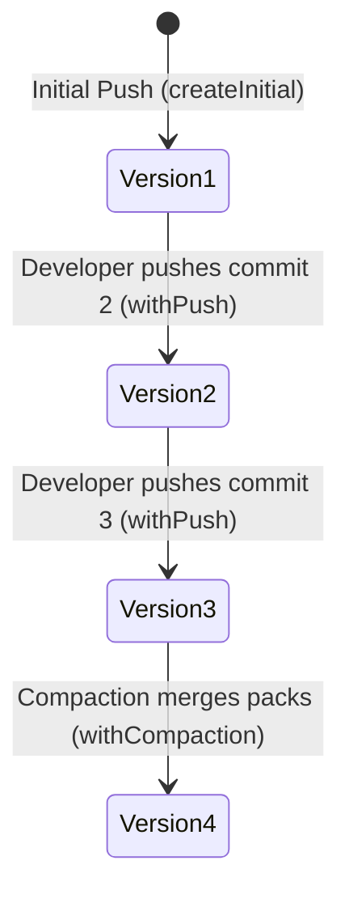

# Phase 2: The WAL Index Data Model & State Transitions

> **Core Objective:** Implement the authoritative WAL Index document schema and immutable state machine that linearizes Git pushes without a relational database.

---

## 🧠 1. The Architectural Problem It Solves

In GitHub's 2013 architecture (**Spokes**):
- Every repository's state was tracked in a central **relational database** (MySQL).
- Updating a branch ref required running a **Three-Phase Commit (3PC)** protocol across 3 physical servers to ensure disk consistency.
- Adding more replicas increased consensus latency, bound by the slowest node (tail latency).

In Cursor's **Continuity**:
- **There is no central SQL database.**
- The complete authoritative state of the repository lives in a single JSON file in S3/R2 called **`wal_index.json`**.
- Linearizability is guaranteed purely by incrementing a monotonic version counter and committing it via S3's Atomic Compare-And-Swap.

---

## 📄 2. The `wal_index.json` Schema

```json
{
  "repoId": "cursor-monorepo",
  "version": 3,
  "references": {
    "refs/heads/main": "c8f3a09e11424bb09e1a89c201...",
    "refs/heads/feature": "87ab12040182ecba410...",
    "refs/tags/v1.0.0": "4b70e816223401127a9..."
  },
  "packfiles": [
    "cursor-monorepo/wal/packs/pack-001-init.pack",
    "cursor-monorepo/wal/packs/pack-002-feature.pack"
  ],
  "lastCompactedVersion": 0,
  "updatedAt": "2026-09-26T10:15:00.000Z"
}
```

### Why Each Field is Essential:
1. **`repoId`:** The unique namespace for the repository within the S3 bucket (`s3://<bucket>/<repoId>/`).
2. **`version`:** Monotonically increasing sequence number (`1, 2, 3...`). Replicas compare their local cached version against S3's version to instantly detect if they are behind.
3. **`references`:** Key-value map of Git refs to commit SHAs. In Git, commits uploaded in a packfile are **unreachable and invisible** until a reference points to them. Publishing a ref inside this file makes the commit officially public in one atomic stroke.
4. **`packfiles`:** The manifest of active binary `.pack` files stored in S3 needed to reconstruct the repository.
5. **`lastCompactedVersion`:** Records the version at which small packfiles were merged into a single compacted packfile.
6. **`updatedAt`:** ISO 8601 timestamp for auditability and debugging.

---

## 🔄 3. The Immutable State Transition Machine

To prevent state corruption, the `WALIndex` class is strictly immutable. Every push or compaction produces a fresh instance with `version + 1`:



### State Transitions in Code (`src/models/wal-index.ts`):

```typescript
// Initializing a new repository
const v1 = WALIndex.createInitial("my-repo", {
  "refs/heads/main": "commit_1_sha"
}, ["my-repo/wal/packs/pack-1.pack"]);

// Advancing state on a new push (v1 is untouched, v2 is created)
const v2 = v1.withPush("main", "commit_2_sha", "my-repo/wal/packs/pack-2.pack");

// Advancing state on compaction (replaces pack array with single compacted pack)
const v3 = v2.withCompaction("my-repo/wal/compacted/pack-merged.pack");
```

---

## ✅ 4. Verification & Testing

Run unit tests verifying state transitions, immutability, and JSON serialization:
```bash
bun test src/tests/wal-index.test.ts
```

Output:
```
✓ should create initial version 1 index with defaults
✓ should serialize to bytes and deserialize back without loss
✓ should create an immutable state transition on push (nextVersion)
✓ should support compaction transitions (replacing packfiles array)
✓ should enforce validation rules
```
